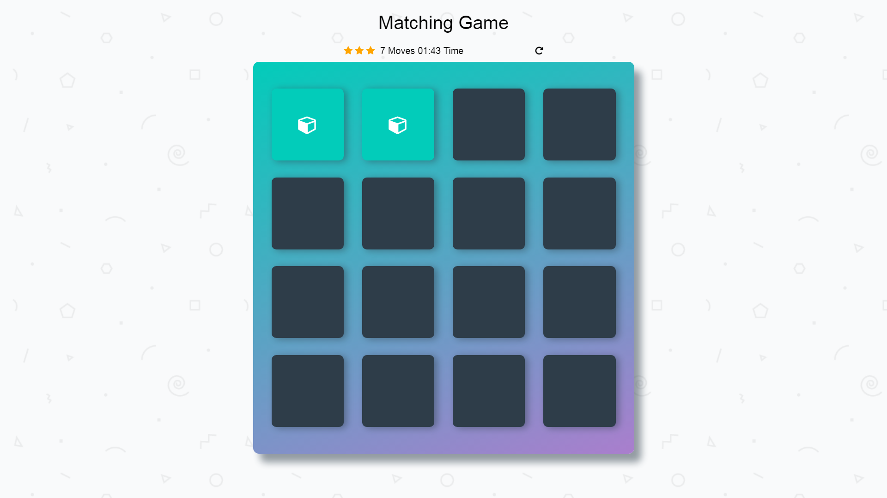

# Memory Game

## Table of Contents

* [Introduction](#introduction)
* [Requirements](#requirements)
* [Challenge](#challenge)
* [Code Dependencies](#code-dependencies)

## Introduction

This is a simple game to test your memory. There is a deck of sixteen different cards. When the game starts the cards appear for 2-3 seconds. Try to remember as many as you can! Then the cards disappear. You should open a pair of cards. Your goal is to find all eight matched pairs. 

## Challenge

Try to finish the game as fast as you can with three stars and less moves.

## Requirements

All you need is a web browser!
Let's play and have fun!

Link to the game: https://anikafaldzhieva.github.io/Matching-Game/

## Code Dependencies

To built this app, I have used HTML, CSS and JavaScript. To make it more interactive I have used different animation. Also I have used the powerfull JS library -  jQuery:

* jQuery UI - for more information [click here](https://jqueryui.com/).
* jQuery Corner plugin - for more information [click here](http://jquery.malsup.com/corner/).
